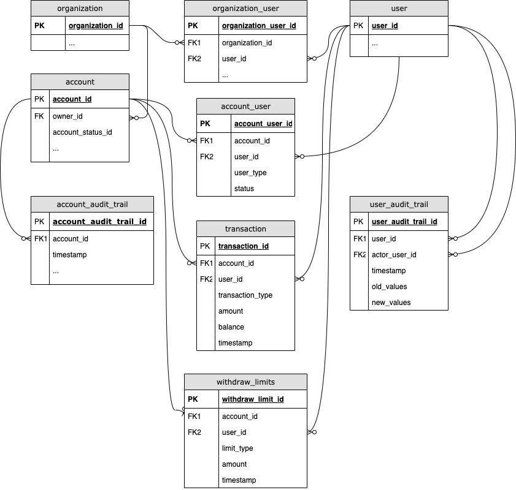

# Shared Bank Account

## RDBMS Schema

### Overview



### Account

* AccountId: uuid, PK
* Owner: uuid FK to Organization
* Account Status: Active or Inactive
* ...

### User

* UserId: uuid, PK
* ...

### Account User

* AccountUserId: uuid, PK
* AccountId: uuid, FK to account, composite Unique Index
* UserId: uuid, FK to users, composite Unique Index
* UserType: Administrator or Standard
* Status: Active or Inactive

### Transaction

* TransactionId: uuid, PK
* AccountId: uuid, FK to account
* UserId: uuid, FK to user
* TransactionType: Deposit or Withdraw
* Amount: money
* Balance: money
* Timestamp: date-time

***Comments***: Append-only table

### Withdraw Limit

* WithdrawLimitId: uuid, PK
* AccountId: uuid, FK to account, composite Unique Index
* UserId: uuid, FK to users, composite Unique Index
* LimitType: daily, weekly, or monthly
* Amount: money
* Timestamp: date-time

***Comments***: Records are append-only to preserve the history. The timestamp used to locate the most recent record for limit validation purposes.

### Organization

* OrganizationId: uuid, PK
* ...

### Organization Users

* OrganizationUserId: uuid, PK
* OrganizationId: uuid, FK
* UserId: uuid, FK
* ...

### Account Audit Trail

* AccountAuditTrailId: uuid, PK
* AccountId: uuid
* ActorUserId: uuid
* Timestamp: date-time
* OldValues: json
* NewValues: json

***Comments***: Append-only table

### Account User Audit Trail

* AccountUserAuditTrailId: uuid, PK
* AccountId: uuid, non-unique index
* UserId: uuid, non-unique index
* ActorUserId: uuid, non-unique index
* Timestamp: date-time, non-unique index desc
* OldValues: json
* NewValues: json

***Comments***: Append-only table

### User Audit Trail

* UserAuditTrailId: uuid, PK
* UserId: uuid, non-unique index
* ActorUserId: uuid, non-unique index
* Timestamp: date-time, non-unique index desc
* OldValues: json
* NewValues: json

***Comments***: Append-only table

## Classes

### Bank Account

#### Methods

* open(admin_user_id: str, account: dict) -> dict
  ```
  * User id will be added to account user as admin
  ```
* get(account_id: str, admin_user_id: str) -> dict
  ```
  * User id must be 'active' on the account user list with type == Administrator
  ```
* update(account_id: str, admin_user_id: str, account_details: dict) -> dict
  ```
  * User id must be 'active' on the account user list with type == Administrator
  ```
* close(account_id: str, admin_user_id: str)
  ```
  * User id must be 'active' on the account user list with type == Administrator
  ```
* deposit_funds(account_id: str, user_id: str, amount: float)
  ```
    * User must be 'active' on the list of account users for the account
  ```
* withdraw_funds(account_id: str, user_id, amount: float) ->  dict
  ```
    * User must not exceed limit as defined in the withdraw limits
    * Withdraw limit is compared to the total of all transactions 
      for the given user for the day, week, or month
    * Withdraw amount should not exceed the latest balance available for the account
  ```  
* view_available_balance(account_id: str, user_id: str) -> dict
  ```
    * Available balance is a delta between withdraw limits
    * And total sum of withdraw transaction for the given user and account 
      for the day, week, or month
  ```
* view_transaction_history(**kwargs) -> list of dict
  ```
  account_id
  user_id: filter transactions by user_id
  start_date: to filter the history, today is the default
  end_date: to filter the history, 2999-12-31 is the default
  transaction_type: to filter the history
  offset: int = 0
  limit: int = 100, max limit is enforced to avoid large result set 
  ```
* view_transaction_history_as_admin:
  ```
  account_id
  admin_user_id: validate user is an account Administrator 
  user_ids: list of str to filter transactions, 
            when list is empty - retrieve all,
            transactions by other admins will be filtered out
  start_date: to filter the history, today is the default
  end_date: to filter the history, 2999-12-31 is the default
  transaction_type: to filter the history
  offset: int = 0
  limit: int = 100, max limit is enforced to avoid large result set 
  ```
* get_withdraw_limits(**kwargs) -> list of dict
  ```
  account_id: str
  admin_user_id: str
  user_id: str = None
  include_inactive: Boolean = False
  offset: int = 0
  limit: int = 100, max limit is enforced to avoid large result set 
  ```
* place_withdraw_limit(**kwargs)
  ```
  account_id
  admin_user_id:   validate the user is on the list of account users 
                  and is active with type == Administrator
  user_id:  validate the user is on the list of account users 
            and is active and with type != Administrator
  limit_type: daily, weekly, or monthly
  amount: verify the value is positive
  ```
* add_user(account_id: str, admin_user_id: str, user: dict) -> dict
  ```
  * Cannot add user to an account where user is not on the list of 
    organization users for the account owner organization
  ```
* get_users(account_id: str, admin_user_id: str, offset: int = 0, limit: int = 100) -> list of dict
* remove_user(account_id: str, admin_user_id: str, user_id: str)
* update_user(account_id: str, admin_user_id: str, user: dict)

### Authorizer

Internal-use class to move validation rules from the Bank Account class

* validate_user_is_admin(account_id: str, user_id: str) -> Boolean
* validate_withdraw_limit(account_id: str, user_id: str, amount: float) -> Boolean

### Repository

Internal-use class to move data repository related code away from other classes

* execute(sql_statement: str)
* execute_query(sql_statement: str) -> list

### Users

* Subcommittee is treated as a user
* No requirements provided for user management

### Organization

* Family is treated as an organization
* No requirements provided for organization management